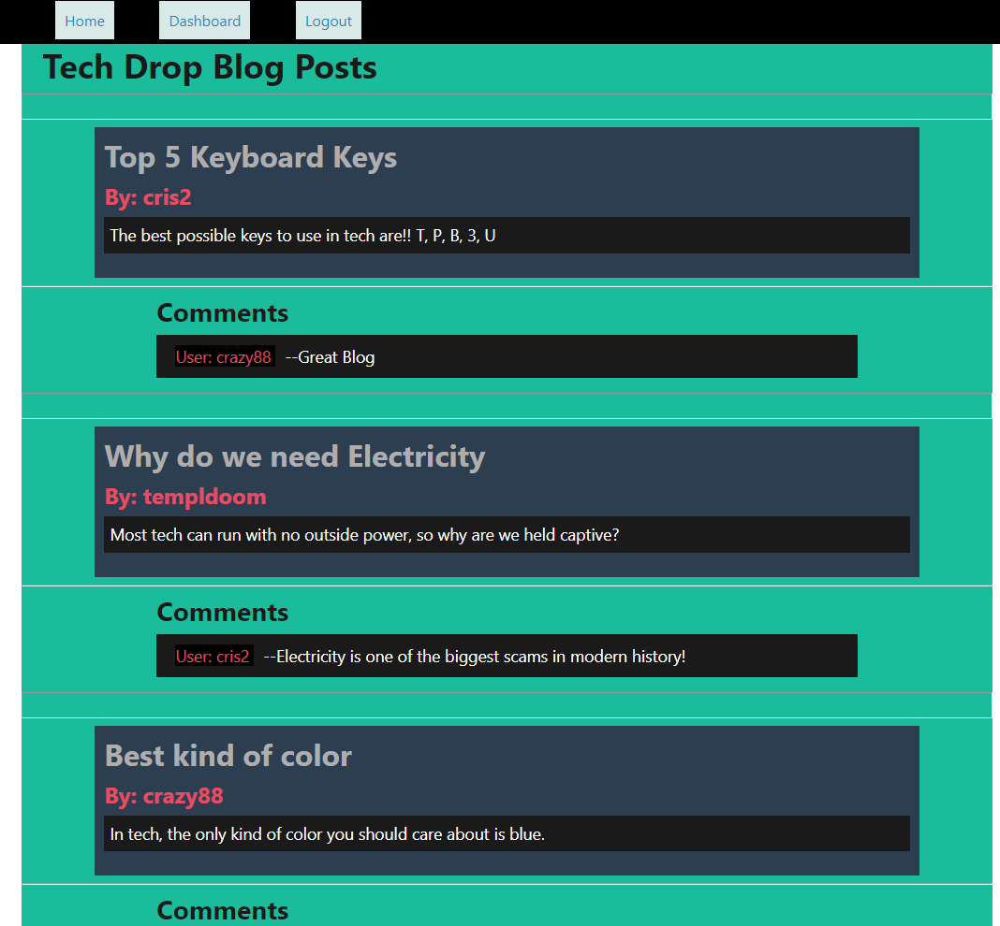
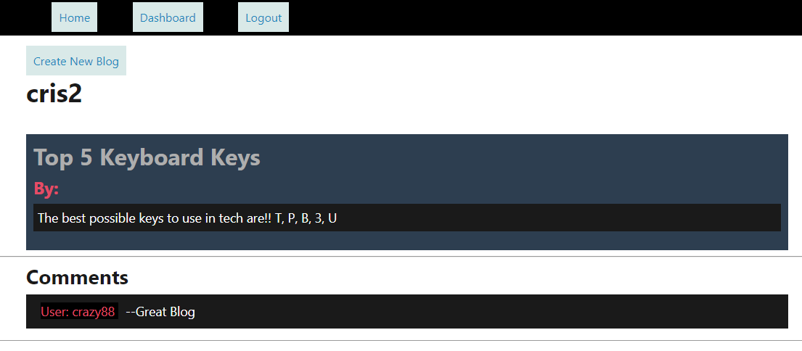
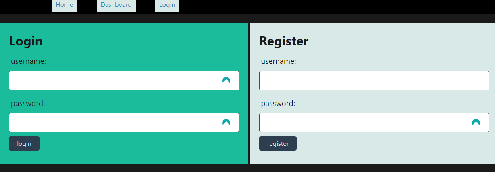

# Tech Blog
This is a repo to host a tech-blog.
User can view all blog posts on the home page.
User can sign-up for an account.
All signed in users can create blog posts. 
Then view their own posts on the dashboard or see their posts on the homepage.

[Deployed Website](https://pacific-sea-24174-25bb61f7768f.herokuapp.com/)

## Install/Local Usage
This application requires [Node](https://nodejs.org) to be installed.
Clone the repo, then run 'npm i' inside the directory with the package.json file.
To deploy app locally,
create a .env file and fill it out with DB variables for local use.
Run the database setup in 'schema.sql' as mysql root user with 'source schema.sql;  
To setup the app with seed data, in root directory run 'npm run seed'.
run 'node server' to start the application.
The application should then be running and able to be used in browser

### Examples

## Credits
This app is a CLI [Node](https://nodejs.org) application   
### npm package
[Sequalize](https://www.npmjs.com/package/sequelize)  
[mysql2](https://www.npmjs.com/package/mysql2)  
[DotEnv](https://www.npmjs.com/package/dotenv)  
[Express](https://www.npmjs.com/package/express)  
[bcrypt](https://www.npmjs.com/package/bcrypt)  
[connect-session-sequelize](https://www.npmjs.com/package/connect-session-sequelize)  
[express-handlebars](https://www.npmjs.com/package/express-handlebars)  
[express-session](https://www.npmjs.com/package/express-session)  
